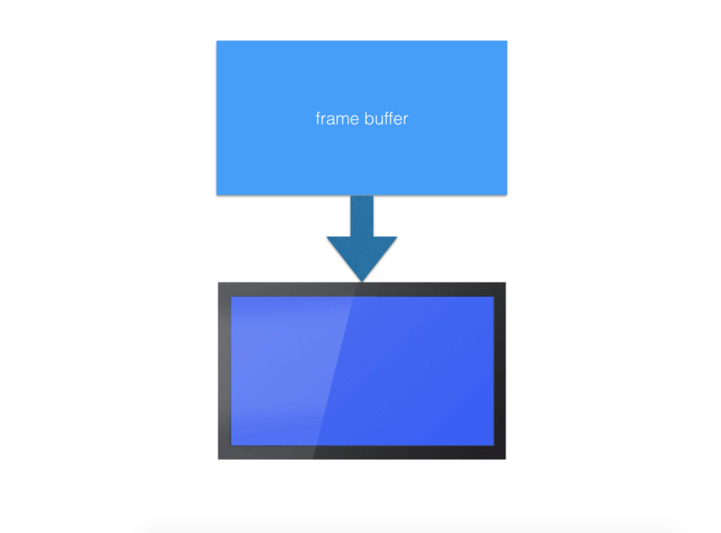
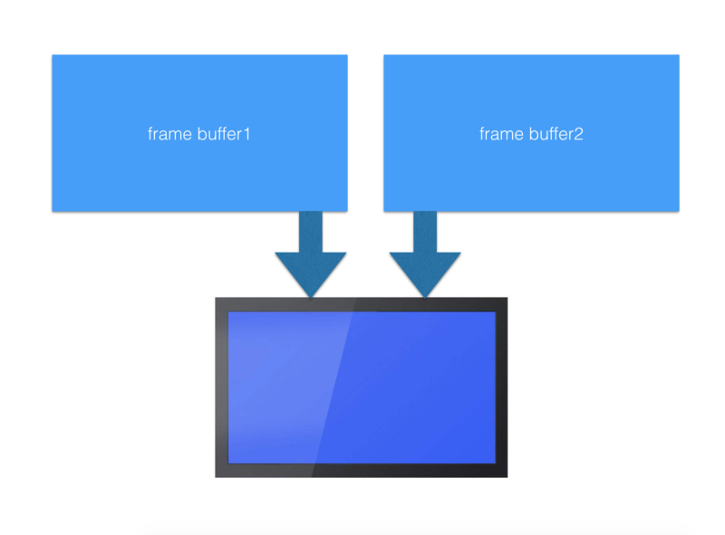
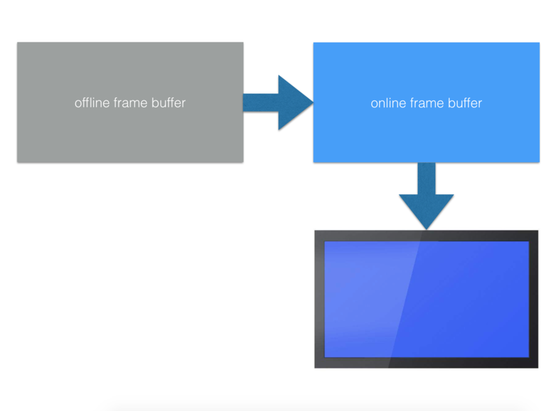

## FrameBuffer的几种使用方式

### 一、单framebuffer。

系统中只有一个framebuffer，LCD使用该framebuffer进行显示，GUI使用该framebuffer进行绘制。

#### 优点：
* 只有一个framebuffer，内存需求减半。
* 无需额外内存拷贝，而且只需画变化的部分，所以性能很高耗电低。

#### 缺点

* GUI绘制的同时LCD在显示，这很容易出现屏幕闪烁。为了避免闪烁，可以在GUI绘制前禁用LCD同步数据(需等待LCD刷完后再禁用)，等绘制完成时再启用LCD同步数据。我在stm32f429igtx上测试，发现确实不闪烁了，但是在窗口动画时，颜色有些不正常。不知是不是LCD频繁启用/禁用，LCD时钟来不及稳定导致的。

> 如果硬件能够解决动画颜色不正常的问题或者不需要动画，这种方式是最好的选择。

### 二、双framebuffer，一个online一个offline，轮流切换显示。

* 1.GUI在offline的framebuffer上绘制。
* 2.LCD显示online的framebuffer。
* 3.GUI绘制完成后，交换两个framebuffer，online变offline，offline变online。

#### 优点：

* 无需内存拷贝，切换LCD的framebuffer地址即可。

#### 缺点

* GUI每次都需要进行完整的绘制，不能只绘制变化的部分。

### 三、双framebuffer，一个固定online供LCD显示，一个规定offline供GUI绘制。

#### 优点：

* 只需绘制变化的部分，绘制完成后，把变化的部分从offline的framebuffer拷贝到online的framebuffer即可。

#### 缺点：

* 窗口动画时，可能整个屏幕都在变化，所以拷贝的量比较大。优化方法：对于平移的动画，可以让GUI直接往online的framebuffer上绘制，减少一次内存拷贝，而且不会出现闪烁。

> 以上方式各有优缺点，请根据具体情况进行选择。AWTK中缺省使用第三种方式，要改用其它方式也是非常简单的。

