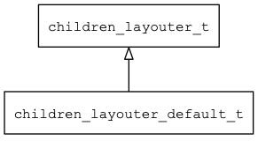

## children\_layouter\_default\_t
### 概述


缺省的子控件布局算法实现。
> 用法请参考：[缺省子控件布局算法](
https://github.com/zlgopen/awtk/blob/master/docs/children_layouter_default.md)

----------------------------------
### 函数
<p id="children_layouter_default_t_methods">

| 函数名称 | 说明 | 
| -------- | ------------ | 
| <a href="#children_layouter_default_t_children_layouter_default_create">children\_layouter\_default\_create</a> | 创建子控件布局对象。 |
| <a href="#children_layouter_default_t_self_layouter_register_builtins">self\_layouter\_register\_builtins</a> | 注册内置的控件自身布局算法。 |
#### children\_layouter\_default\_create 函数
-----------------------

* 函数功能：

> <p id="children_layouter_default_t_children_layouter_default_create">创建子控件布局对象。


* 函数原型：

```
children_layouter_t* children_layouter_default_create ();
```

* 参数说明：

| 参数 | 类型 | 说明 |
| -------- | ----- | --------- |
| 返回值 | children\_layouter\_t* | 返回创建子控件布局对象。 |
#### self\_layouter\_register\_builtins 函数
-----------------------

* 函数功能：

> <p id="children_layouter_default_t_self_layouter_register_builtins">注册内置的控件自身布局算法。


* 函数原型：

```
ret_t self_layouter_register_builtins ();
```

* 参数说明：

| 参数 | 类型 | 说明 |
| -------- | ----- | --------- |
| 返回值 | ret\_t | 返回RET\_OK表示成功，否则表示失败。 |
