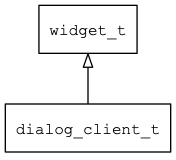

## dialog\_client\_t
### 概述


对话框客户区控件。

 它本身不提供布局功能，仅提供具有语义的标签，让xml更具有可读性。
 子控件的布局可用layout\_children属性指定。
 请参考[布局参数](https://github.com/zlgopen/awtk/blob/master/docs/layout.md)。

 dialog\_client\_t是[widget\_t](widget_t.md)的子类控件，widget\_t的函数均适用于dialog\_client\_t控件。

 在xml中使用"dialog\_client"标签创建dialog\_client。如：

 ```xml
 <dialog anim_hint="center_scale(duration=300)" x="c" y="m" w="80%" h="160" text="Dialog">
 <dialog_title x="0" y="0" w="100%" h="30" text="Hello AWTK" />
 <dialog_client x="0" y="bottom" w="100%" h="-30">
   <label name="" x="center" y="middle:-20" w="200" h="30" text="Are you ready?"/>
   <button name="quit" x="10" y="bottom:10" w="40%" h="30" text="确定"/>
   <button name="quit" x="right:10" y="bottom:10" w="40%" h="30" text="取消"/>
 </dialog_client>
 </dialog>
 ```

 在c代码中，用dialog\_create\_simple创建对话框时，自动创建dialog客户区对象。
----------------------------------
### 函数
<p id="dialog_client_t_methods">

| 函数名称 | 说明 | 
| -------- | ------------ | 
| <a href="#dialog_client_t_dialog_client_cast">dialog\_client\_cast</a> | 转换为dialog_client对象(供脚本语言使用)。 |
| <a href="#dialog_client_t_dialog_client_create">dialog\_client\_create</a> | 创建dialog客户区对象。 |
#### dialog\_client\_cast 函数
-----------------------

* 函数功能：

> <p id="dialog_client_t_dialog_client_cast">转换为dialog_client对象(供脚本语言使用)。

* 函数原型：

```
widget_t* dialog_client_cast (widget_t* widget);
```

* 参数说明：

| 参数 | 类型 | 说明 |
| -------- | ----- | --------- |
| 返回值 | widget\_t* | dialog\_client对象。 |
| widget | widget\_t* | dialog\_client对象。 |
#### dialog\_client\_create 函数
-----------------------

* 函数功能：

> <p id="dialog_client_t_dialog_client_create">创建dialog客户区对象。

* 函数原型：

```
widget_t* dialog_client_create (widget_t* parent, xy_t x, xy_t y, wh_t w, wh_t h);
```

* 参数说明：

| 参数 | 类型 | 说明 |
| -------- | ----- | --------- |
| 返回值 | widget\_t* | dialog对象。 |
| parent | widget\_t* | 父控件 |
| x | xy\_t | x坐标 |
| y | xy\_t | y坐标 |
| w | wh\_t | 宽度 |
| h | wh\_t | 高度 |
