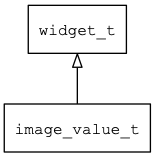

## image\_value\_t
### 概述


 图片值控件。

 可以用图片来表示如电池电量、WIFI信号强度和其它各种数值的值。

 其原理如下：

  * 1.把value以format为格式转换成字符串。
  * 2.把每个字符与image(图片文件名前缀)映射成一个图片名。
  * 3.最后把这些图片显示出来。

image\_value\_t是[widget\_t](widget_t.md)的子类控件，widget\_t的函数均适用于image\_value\_t控件。

在xml中使用"image\_value"标签创建图片值控件。如：

 ```xml
 <image_value  value="0" image="num_" />
 ```

 > 更多用法请参考：
 [image\_value](https://github.com/zlgopen/awtk/blob/master/demos/assets/raw/ui/image_value.xml)

 在c代码中使用函数image\_value\_create创建图片值控件。如：

 ```c
 image_value = image_value_create(win, 10, 10, 200, 200);
 image_value_set_image(image_value, "num_");
 image_value_set_value(image_value, 100);
 ```

 > 完整示例请参考：
 [image_value demo](https://github.com/zlgopen/awtk-c-demos/blob/master/demos/image_value.c)

 可用通过style来设置控件的显示风格，如背景颜色和边框等等，不过一般情况并不需要。


----------------------------------
### 函数
<p id="image_value_t_methods">

| 函数名称 | 说明 | 
| -------- | ------------ | 
| <a href="#image_value_t_image_value_cast">image\_value\_cast</a> | 转换为image_value对象(供脚本语言使用)。 |
| <a href="#image_value_t_image_value_create">image\_value\_create</a> | 创建image_value对象 |
| <a href="#image_value_t_image_value_set_format">image\_value\_set\_format</a> | 设置格式。 |
| <a href="#image_value_t_image_value_set_image">image\_value\_set\_image</a> | 设置图片前缀。 |
| <a href="#image_value_t_image_value_set_value">image\_value\_set\_value</a> | 设置值。 |
### 属性
<p id="image_value_t_properties">

| 属性名称 | 类型 | 说明 | 
| -------- | ----- | ------------ | 
| <a href="#image_value_t_format">format</a> | char* | 数值到字符串转换时的格式，缺省为"%d"。 |
| <a href="#image_value_t_image">image</a> | char* | 图片名称的前缀。 |
| <a href="#image_value_t_value">value</a> | float\_t | 值。 |
#### image\_value\_cast 函数
-----------------------

* 函数功能：

> <p id="image_value_t_image_value_cast"> 转换为image_value对象(供脚本语言使用)。


* 函数原型：

```
widget_t* image_value_cast (widget_t* widget);
```

* 参数说明：

| 参数 | 类型 | 说明 |
| -------- | ----- | --------- |
| 返回值 | widget\_t* | image\_value对象。 |
| widget | widget\_t* | image\_value对象。 |
#### image\_value\_create 函数
-----------------------

* 函数功能：

> <p id="image_value_t_image_value_create"> 创建image_value对象


* 函数原型：

```
widget_t* image_value_create (widget_t* parent, xy_t x, xy_t y, wh_t w, wh_t h);
```

* 参数说明：

| 参数 | 类型 | 说明 |
| -------- | ----- | --------- |
| 返回值 | widget\_t* | 对象。 |
| parent | widget\_t* | 父控件 |
| x | xy\_t | x坐标 |
| y | xy\_t | y坐标 |
| w | wh\_t | 宽度 |
| h | wh\_t | 高度 |
#### image\_value\_set\_format 函数
-----------------------

* 函数功能：

> <p id="image_value_t_image_value_set_format"> 设置格式。


* 函数原型：

```
ret_t image_value_set_format (widget_t* widget, const char* format);
```

* 参数说明：

| 参数 | 类型 | 说明 |
| -------- | ----- | --------- |
| 返回值 | ret\_t | 返回RET\_OK表示成功，否则表示失败。 |
| widget | widget\_t* | image\_value对象。 |
| format | const char* | 格式。 |
#### image\_value\_set\_image 函数
-----------------------

* 函数功能：

> <p id="image_value_t_image_value_set_image"> 设置图片前缀。


* 函数原型：

```
ret_t image_value_set_image (widget_t* widget, const char* image);
```

* 参数说明：

| 参数 | 类型 | 说明 |
| -------- | ----- | --------- |
| 返回值 | ret\_t | 返回RET\_OK表示成功，否则表示失败。 |
| widget | widget\_t* | image\_value对象。 |
| image | const char* | 图片前缀。 |
#### image\_value\_set\_value 函数
-----------------------

* 函数功能：

> <p id="image_value_t_image_value_set_value"> 设置值。


* 函数原型：

```
ret_t image_value_set_value (widget_t* widget, float_t value);
```

* 参数说明：

| 参数 | 类型 | 说明 |
| -------- | ----- | --------- |
| 返回值 | ret\_t | 返回RET\_OK表示成功，否则表示失败。 |
| widget | widget\_t* | image\_value对象。 |
| value | float\_t | 值。 |
#### format 属性
-----------------------
> <p id="image_value_t_format"> 数值到字符串转换时的格式，缺省为"%d"。


* 类型：char*

| 特性 | 是否支持 |
| -------- | ----- |
| 可直接读取 | 是 |
| 可直接修改 | 否 |
| 可持久化   | 是 |
| 可脚本化   | 是 |
| 可在IDE中设置 | 是 |
| 可在XML中设置 | 是 |
| 可通过widget\_get\_prop读取 | 是 |
| 可通过widget\_set\_prop修改 | 是 |
#### image 属性
-----------------------
> <p id="image_value_t_image"> 图片名称的前缀。


* 类型：char*

| 特性 | 是否支持 |
| -------- | ----- |
| 可直接读取 | 是 |
| 可直接修改 | 否 |
| 可持久化   | 是 |
| 可脚本化   | 是 |
| 可在IDE中设置 | 是 |
| 可在XML中设置 | 是 |
| 可通过widget\_get\_prop读取 | 是 |
| 可通过widget\_set\_prop修改 | 是 |
#### value 属性
-----------------------
> <p id="image_value_t_value"> 值。


* 类型：float\_t

| 特性 | 是否支持 |
| -------- | ----- |
| 可直接读取 | 是 |
| 可直接修改 | 否 |
| 可持久化   | 是 |
| 可脚本化   | 是 |
| 可在IDE中设置 | 是 |
| 可在XML中设置 | 是 |
| 可通过widget\_get\_prop读取 | 是 |
| 可通过widget\_set\_prop修改 | 是 |
