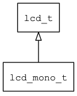

## lcd\_mono\_t
### 概述


单色LCD。

 lcd\_mono是一个特殊的Framebuffer，它用一个比特来表示一个pixel。

 lcd\_mono只是负责硬件无关的逻辑处理，调用者需要在创建时提供一个flush回调函数，
 在flush函数中把脏矩形中的数据刷新到硬件中。
----------------------------------
### 函数
<p id="lcd_mono_t_methods">

| 函数名称 | 说明 | 
| -------- | ------------ | 
| <a href="#lcd_mono_t_lcd_mono_create">lcd\_mono\_create</a> | 创建单色LCD对象。 |
### 属性
<p id="lcd_mono_t_properties">

| 属性名称 | 类型 | 说明 | 
| -------- | ----- | ------------ | 
| <a href="#lcd_mono_t_data">data</a> | uint8\_t* | Framebuffer首地址。 |
#### lcd\_mono\_create 函数
-----------------------

* 函数功能：

> <p id="lcd_mono_t_lcd_mono_create">创建单色LCD对象。

* 函数原型：

```
lcd_t* lcd_mono_create (wh_t w, wh_t h, lcd_flush_t flush, lcd_destroy_t on_destroy, void* ctx);
```

* 参数说明：

| 参数 | 类型 | 说明 |
| -------- | ----- | --------- |
| 返回值 | lcd\_t* | lcd对象。 |
| w | wh\_t | 宽度。 |
| h | wh\_t | 高度。 |
| flush | lcd\_flush\_t | 用于刷新数据到硬件的回调函数。 |
| on\_destroy | lcd\_destroy\_t | 销毁lcd时的回调函数。 |
| ctx | void* | flush/on\_destroy回调函数的上下文。 |
#### data 属性
-----------------------
> <p id="lcd_mono_t_data">Framebuffer首地址。

* 类型：uint8\_t*

| 特性 | 是否支持 |
| -------- | ----- |
| 可直接读取 | 是 |
| 可直接修改 | 否 |
