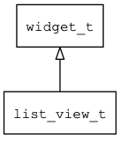

## list\_view\_t
### 概述


 列表视图控件。

 列表视图控件是一个可以垂直滚动的列表控件。

 如果不需要滚动，可以用view控件配置适当的layout参数作为列表控件。

 列表视图中的列表项可以固定高度，也可以使用不同高度。请参考[变高列表项](
https://github.com/zlgopen/awtk/blob/master/demos/assets/raw/ui/list_view_vh.xml)

 列表视图控件的中可以有滚动条，也可以没有滚动条。
 可以使用移动设备风格的滚动条，也可以使用桌面风格的滚动条。

 list\_view\_t是[widget\_t](widget_t.md)的子类控件，widget\_t的函数均适用于list\_view\_t控件。

 在xml中使用"list\_view"标签创建列表视图控件。如：

 ```xml
 <list_view x="0"  y="30" w="100%" h="-80" item_height="60">
   <scroll_view name="view" x="0"  y="0" w="100%" h="100%">
     <list_item style="odd" children_layout="default(rows=1,cols=0)">
       <image draw_type="icon" w="30" image="earth"/>
       <label w="-30" text="1.Hello AWTK !">
         <switch x="r:10" y="m" w="60" h="20"/>
       </label>
     </list_item>
     ...
   </scroll_view>
  </list_view>
 ```

 > 注意：列表项不是作为列表视图控件的直接子控件，而是作为滚动视图的子控件。


 > 更多用法请参考：[list\_view\_m.xml](
https://github.com/zlgopen/awtk/blob/master/demos/assets/raw/ui/list_view_m.xml)

 在c代码中使用函数list\_view\_create创建列表视图控件。如：

 ```c
  widget_t* list_view = list_view_create(win, 0, 0, 0, 0);
 ```

 用代码构造列表视图是比较繁琐的事情，最好用XML来构造。
 如果需要动态修改，可以使用widget\_clone来增加列表项，使用widget\_remove\_child来移出列表项。

 可用通过style来设置控件的显示风格，如背景颜色和边框颜色等(一般情况不需要)。


----------------------------------
### 函数
<p id="list_view_t_methods">

| 函数名称 | 说明 | 
| -------- | ------------ | 
| <a href="#list_view_t_list_view_cast">list\_view\_cast</a> | 转换为list_view对象(供脚本语言使用)。 |
| <a href="#list_view_t_list_view_create">list\_view\_create</a> | 创建list_view对象 |
| <a href="#list_view_t_list_view_set_auto_hide_scroll_bar">list\_view\_set\_auto\_hide\_scroll\_bar</a> | 设置是否自动隐藏滚动条。 |
| <a href="#list_view_t_list_view_set_default_item_height">list\_view\_set\_default\_item\_height</a> | 设置列表项的缺省高度。 |
| <a href="#list_view_t_list_view_set_item_height">list\_view\_set\_item\_height</a> | 设置列表项的高度。 |
### 属性
<p id="list_view_t_properties">

| 属性名称 | 类型 | 说明 | 
| -------- | ----- | ------------ | 
| <a href="#list_view_t_auto_hide_scroll_bar">auto\_hide\_scroll\_bar</a> | bool\_t | 如果不需要滚动条时，自动隐藏滚动条。 |
| <a href="#list_view_t_default_item_height">default\_item\_height</a> | int32\_t | 列表项的缺省高度。如果item_height <= 0 而且列表项自身的高度 <= 0，则使用缺省高度。 |
| <a href="#list_view_t_item_height">item\_height</a> | int32\_t | 列表项的高度。如果 item_height > 0，所有列表项使用固定高度，否则使用列表项自身的高度。 |
#### list\_view\_cast 函数
-----------------------

* 函数功能：

> <p id="list_view_t_list_view_cast"> 转换为list_view对象(供脚本语言使用)。


* 函数原型：

```
widget_t* list_view_cast (widget_t* widget);
```

* 参数说明：

| 参数 | 类型 | 说明 |
| -------- | ----- | --------- |
| 返回值 | widget\_t* | list\_view对象。 |
| widget | widget\_t* | list\_view对象。 |
#### list\_view\_create 函数
-----------------------

* 函数功能：

> <p id="list_view_t_list_view_create"> 创建list_view对象


* 函数原型：

```
widget_t* list_view_create (widget_t* parent, xy_t x, xy_t y, wh_t w, wh_t h);
```

* 参数说明：

| 参数 | 类型 | 说明 |
| -------- | ----- | --------- |
| 返回值 | widget\_t* | 对象。 |
| parent | widget\_t* | 父控件 |
| x | xy\_t | x坐标 |
| y | xy\_t | y坐标 |
| w | wh\_t | 宽度 |
| h | wh\_t | 高度 |
#### list\_view\_set\_auto\_hide\_scroll\_bar 函数
-----------------------

* 函数功能：

> <p id="list_view_t_list_view_set_auto_hide_scroll_bar"> 设置是否自动隐藏滚动条。


* 函数原型：

```
ret_t list_view_set_auto_hide_scroll_bar (widget_t* widget, bool_t auto_hide_scroll_bar);
```

* 参数说明：

| 参数 | 类型 | 说明 |
| -------- | ----- | --------- |
| 返回值 | ret\_t | 返回RET\_OK表示成功，否则表示失败。 |
| widget | widget\_t* | 控件对象。 |
| auto\_hide\_scroll\_bar | bool\_t | 是否自动隐藏滚动条。 |
#### list\_view\_set\_default\_item\_height 函数
-----------------------

* 函数功能：

> <p id="list_view_t_list_view_set_default_item_height"> 设置列表项的缺省高度。


* 函数原型：

```
ret_t list_view_set_default_item_height (widget_t* widget, int32_t default_item_height);
```

* 参数说明：

| 参数 | 类型 | 说明 |
| -------- | ----- | --------- |
| 返回值 | ret\_t | 返回RET\_OK表示成功，否则表示失败。 |
| widget | widget\_t* | 控件对象。 |
| default\_item\_height | int32\_t | 列表项的高度。 |
#### list\_view\_set\_item\_height 函数
-----------------------

* 函数功能：

> <p id="list_view_t_list_view_set_item_height"> 设置列表项的高度。


* 函数原型：

```
ret_t list_view_set_item_height (widget_t* widget, int32_t item_height);
```

* 参数说明：

| 参数 | 类型 | 说明 |
| -------- | ----- | --------- |
| 返回值 | ret\_t | 返回RET\_OK表示成功，否则表示失败。 |
| widget | widget\_t* | 控件对象。 |
| item\_height | int32\_t | 列表项的高度。 |
#### auto\_hide\_scroll\_bar 属性
-----------------------
> <p id="list_view_t_auto_hide_scroll_bar"> 如果不需要滚动条时，自动隐藏滚动条。


* 类型：bool\_t

| 特性 | 是否支持 |
| -------- | ----- |
| 可直接读取 | 是 |
| 可直接修改 | 否 |
| 可持久化   | 是 |
| 可脚本化   | 是 |
| 可在IDE中设置 | 是 |
| 可在XML中设置 | 是 |
| 可通过widget\_get\_prop读取 | 是 |
| 可通过widget\_set\_prop修改 | 是 |
#### default\_item\_height 属性
-----------------------
> <p id="list_view_t_default_item_height"> 列表项的缺省高度。如果item_height <= 0 而且列表项自身的高度 <= 0，则使用缺省高度。


* 类型：int32\_t

| 特性 | 是否支持 |
| -------- | ----- |
| 可直接读取 | 是 |
| 可直接修改 | 否 |
| 可持久化   | 是 |
| 可脚本化   | 是 |
| 可在IDE中设置 | 是 |
| 可在XML中设置 | 是 |
| 可通过widget\_get\_prop读取 | 是 |
| 可通过widget\_set\_prop修改 | 是 |
#### item\_height 属性
-----------------------
> <p id="list_view_t_item_height"> 列表项的高度。如果 item_height > 0，所有列表项使用固定高度，否则使用列表项自身的高度。


* 类型：int32\_t

| 特性 | 是否支持 |
| -------- | ----- |
| 可直接读取 | 是 |
| 可直接修改 | 否 |
| 可持久化   | 是 |
| 可脚本化   | 是 |
| 可在IDE中设置 | 是 |
| 可在XML中设置 | 是 |
| 可通过widget\_get\_prop读取 | 是 |
| 可通过widget\_set\_prop修改 | 是 |
