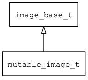

## mutable\_image\_t
### 概述


mutable图片控件。

 像摄像头和视频的图像是变化的，每一帧都不同，我们把这类图片称为mutable image。

 本控件辅助实现摄像头和视频的显示功能。

 mutable\_image\_t是[image\_base\_t](image_base_t.md)的子类控件，image\_base\_t的函数均适用于mutable\_image\_t控件。

 在xml中使用"mutable\_image"标签创建mutable图片控件。如：

 ```xml
 <mutable_image w="100%" h="100%"/>
 ```

 >更多用法请参考：
 [mutable
 image](https://github.com/zlgopen/awtk/blob/master/demos/assets/default/raw/ui/mutable_image.xml)

 在c代码中使用函数mutable\_image\_create创建mutable图片控件。如：

 ```c
  widget_t* image = mutable_image_create(win, 10, 10, 200, 200);
  mutable_image_set_prepare_image(image, get_camera_image, camera);
 ```

 > 创建之后:
 >
 > 需要用mutable\_image\_set\_prepare\_image设置准备图片的回调函数。

 > 完整示例请参考：[mutable image demo](
 https://github.com/zlgopen/awtk-c-demos/blob/master/demos/mutable_image.c)

 一般不需通过style来设置控件的显示风格，如果在特殊情况下需要，可以参考其它控件。
----------------------------------
### 函数
<p id="mutable_image_t_methods">

| 函数名称 | 说明 | 
| -------- | ------------ | 
| <a href="#mutable_image_t_mutable_image_cast">mutable\_image\_cast</a> | 转换为mutable_image对象(供脚本语言使用)。 |
| <a href="#mutable_image_t_mutable_image_create">mutable\_image\_create</a> | 创建mutable_image对象 |
| <a href="#mutable_image_t_mutable_image_set_framebuffer">mutable\_image\_set\_framebuffer</a> | 设置framebuffer(当硬件支持多层合成时才用)。

 有的硬件支持多层framebuffer，一层用于视图/摄像头，一层用于GUI，由硬件合成最终图像。
 此时可以设置用于摄像头的framebuffer，图像直接绘制到该framebuffer上。 |
| <a href="#mutable_image_t_mutable_image_set_prepare_image">mutable\_image\_set\_prepare\_image</a> | 设置prepare_image回调函数。

 prepare_image回调函数在每次绘制之前被调用，用于准备下一帧要显示的图片。
 比如获取摄像头的预览图片，将其设置到image参数中。

 注意：在回调函数中，只能修改图片的内容，不用修改图片的大小和格式，如果不匹配请先转换。 |
#### mutable\_image\_cast 函数
-----------------------

* 函数功能：

> <p id="mutable_image_t_mutable_image_cast">转换为mutable_image对象(供脚本语言使用)。

* 函数原型：

```
widget_t* mutable_image_cast (widget_t* widget);
```

* 参数说明：

| 参数 | 类型 | 说明 |
| -------- | ----- | --------- |
| 返回值 | widget\_t* | mutable\_image对象。 |
| widget | widget\_t* | mutable\_image对象。 |
#### mutable\_image\_create 函数
-----------------------

* 函数功能：

> <p id="mutable_image_t_mutable_image_create">创建mutable_image对象

* 函数原型：

```
widget_t* mutable_image_create (widget_t* parent, xy_t x, xy_t y, wh_t w, wh_t h);
```

* 参数说明：

| 参数 | 类型 | 说明 |
| -------- | ----- | --------- |
| 返回值 | widget\_t* | 对象。 |
| parent | widget\_t* | 父控件 |
| x | xy\_t | x坐标 |
| y | xy\_t | y坐标 |
| w | wh\_t | 宽度 |
| h | wh\_t | 高度 |
#### mutable\_image\_set\_framebuffer 函数
-----------------------

* 函数功能：

> <p id="mutable_image_t_mutable_image_set_framebuffer">设置framebuffer(当硬件支持多层合成时才用)。

 有的硬件支持多层framebuffer，一层用于视图/摄像头，一层用于GUI，由硬件合成最终图像。
 此时可以设置用于摄像头的framebuffer，图像直接绘制到该framebuffer上。

* 函数原型：

```
ret_t mutable_image_set_framebuffer (widget_t* widget, uint32_t w, uint32_t h, bitmap_format_t format, uint8_t* buff);
```

* 参数说明：

| 参数 | 类型 | 说明 |
| -------- | ----- | --------- |
| 返回值 | ret\_t | 返回RET\_OK表示成功，否则表示失败。 |
| widget | widget\_t* | mutable\_image对象。 |
| w | uint32\_t | framebuffer宽度。 |
| h | uint32\_t | framebuffer高度。 |
| format | bitmap\_format\_t | framebuffer的格式。 |
| buff | uint8\_t* | framebuffer内存。 |
#### mutable\_image\_set\_prepare\_image 函数
-----------------------

* 函数功能：

> <p id="mutable_image_t_mutable_image_set_prepare_image">设置prepare_image回调函数。

 prepare_image回调函数在每次绘制之前被调用，用于准备下一帧要显示的图片。
 比如获取摄像头的预览图片，将其设置到image参数中。

 注意：在回调函数中，只能修改图片的内容，不用修改图片的大小和格式，如果不匹配请先转换。

* 函数原型：

```
ret_t mutable_image_set_prepare_image (widget_t* widget, mutable_image_prepare_image_t prepare_image, void* prepare_image_ctx);
```

* 参数说明：

| 参数 | 类型 | 说明 |
| -------- | ----- | --------- |
| 返回值 | ret\_t | 返回RET\_OK表示成功，否则表示失败。 |
| widget | widget\_t* | mutable\_image对象。 |
| prepare\_image | mutable\_image\_prepare\_image\_t | 准备图片的回调函数。 |
| prepare\_image\_ctx | void* | prepare\_image回调函数的上下文。 |
