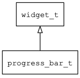

## progress\_bar\_t
### 概述


进度条控件。

 进度条控件可以水平显示也可以垂直显示，由vertical属性决定。

 progress\_bar\_t是[widget\_t](widget_t.md)的子类控件，widget\_t的函数均适用于progress\_bar\_t控件。

 在xml中使用"progress\_bar"标签创建进度条控件。如：

 ```xml
  <progress_bar name="bar1" x="10" y="128" w="240" h="30" value="40"/>
  <progress_bar name="bar2" x="280" y="128" w="30" h="118" value="20" vertical="true"/>
 ```

 > 更多用法请参考：
 [basic demo](https://github.com/zlgopen/awtk/blob/master/demos/assets/default/raw/ui/basic.xml)

 在c代码中使用函数progress\_bar\_create创建进度条控件。如：

 ```c
  widget_t* progress_bar = progress_bar_create(win, 10, 10, 128, 30);
 ```

 > 完整示例请参考：
 [progress_bar demo](https://github.com/zlgopen/awtk-c-demos/blob/master/demos/progress_bar.c)

 可用通过style来设置控件的显示风格，如字体的大小和颜色等等。如：

 ```xml
 <style>
   <normal bg_color="#f0f0f0" text_color="gold" fg_color="#c0c0c0" border_color="#a0a0a0" />
 </style>
 ```

 > 更多用法请参考：
 [theme
 default](https://github.com/zlgopen/awtk/blob/master/demos/assets/default/raw/styles/default.xml#L183)
----------------------------------
### 函数
<p id="progress_bar_t_methods">

| 函数名称 | 说明 | 
| -------- | ------------ | 
| <a href="#progress_bar_t_progress_bar_cast">progress\_bar\_cast</a> | 转换为progress_bar对象(供脚本语言使用)。 |
| <a href="#progress_bar_t_progress_bar_create">progress\_bar\_create</a> | 创建progress_bar对象 |
| <a href="#progress_bar_t_progress_bar_get_percent">progress\_bar\_get\_percent</a> | 获取进度百分比。

 > 当max为100时，percent和value取整后一致。 |
| <a href="#progress_bar_t_progress_bar_set_max">progress\_bar\_set\_max</a> | 设置最大值。 |
| <a href="#progress_bar_t_progress_bar_set_show_text">progress\_bar\_set\_show\_text</a> | 设置进度条的是否显示文本。 |
| <a href="#progress_bar_t_progress_bar_set_value">progress\_bar\_set\_value</a> | 设置进度条的进度。 |
| <a href="#progress_bar_t_progress_bar_set_vertical">progress\_bar\_set\_vertical</a> | 设置进度条的方向。 |
### 属性
<p id="progress_bar_t_properties">

| 属性名称 | 类型 | 说明 | 
| -------- | ----- | ------------ | 
| <a href="#progress_bar_t_max">max</a> | float\_t | 最大值(缺省为100)。 |
| <a href="#progress_bar_t_show_text">show\_text</a> | bool\_t | 是否显示文本。 |
| <a href="#progress_bar_t_value">value</a> | float\_t | 进度条的值[0-100]。 |
| <a href="#progress_bar_t_vertical">vertical</a> | bool\_t | 进度条的是否为垂直方向。 |
### 事件
<p id="progress_bar_t_events">

| 事件名称 | 类型  | 说明 | 
| -------- | ----- | ------- | 
| EVT\_VALUE\_WILL\_CHANGE | event\_t | 值即将改变事件。 |
| EVT\_VALUE\_CHANGED | event\_t | 值改变事件。 |
#### progress\_bar\_cast 函数
-----------------------

* 函数功能：

> <p id="progress_bar_t_progress_bar_cast">转换为progress_bar对象(供脚本语言使用)。

* 函数原型：

```
widget_t* progress_bar_cast (widget_t* widget);
```

* 参数说明：

| 参数 | 类型 | 说明 |
| -------- | ----- | --------- |
| 返回值 | widget\_t* | progress\_bar对象。 |
| widget | widget\_t* | progress\_bar对象。 |
#### progress\_bar\_create 函数
-----------------------

* 函数功能：

> <p id="progress_bar_t_progress_bar_create">创建progress_bar对象

* 函数原型：

```
widget_t* progress_bar_create (widget_t* parent, xy_t x, xy_t y, wh_t w, wh_t h);
```

* 参数说明：

| 参数 | 类型 | 说明 |
| -------- | ----- | --------- |
| 返回值 | widget\_t* | 对象。 |
| parent | widget\_t* | 父控件 |
| x | xy\_t | x坐标 |
| y | xy\_t | y坐标 |
| w | wh\_t | 宽度 |
| h | wh\_t | 高度 |
#### progress\_bar\_get\_percent 函数
-----------------------

* 函数功能：

> <p id="progress_bar_t_progress_bar_get_percent">获取进度百分比。

 > 当max为100时，percent和value取整后一致。

* 函数原型：

```
uint32_t progress_bar_get_percent (widget_t* widget);
```

* 参数说明：

| 参数 | 类型 | 说明 |
| -------- | ----- | --------- |
| 返回值 | uint32\_t | 返回百分比。 |
| widget | widget\_t* | 控件对象。 |
#### progress\_bar\_set\_max 函数
-----------------------

* 函数功能：

> <p id="progress_bar_t_progress_bar_set_max">设置最大值。

* 函数原型：

```
ret_t progress_bar_set_max (widget_t* widget, uint32_t max);
```

* 参数说明：

| 参数 | 类型 | 说明 |
| -------- | ----- | --------- |
| 返回值 | ret\_t | 返回RET\_OK表示成功，否则表示失败。 |
| widget | widget\_t* | 控件对象。 |
| max | uint32\_t | 最大值。 |
#### progress\_bar\_set\_show\_text 函数
-----------------------

* 函数功能：

> <p id="progress_bar_t_progress_bar_set_show_text">设置进度条的是否显示文本。

* 函数原型：

```
ret_t progress_bar_set_show_text (widget_t* widget, bool_t show_text);
```

* 参数说明：

| 参数 | 类型 | 说明 |
| -------- | ----- | --------- |
| 返回值 | ret\_t | 返回RET\_OK表示成功，否则表示失败。 |
| widget | widget\_t* | 控件对象。 |
| show\_text | bool\_t | 是否显示文本。 |
#### progress\_bar\_set\_value 函数
-----------------------

* 函数功能：

> <p id="progress_bar_t_progress_bar_set_value">设置进度条的进度。

* 函数原型：

```
ret_t progress_bar_set_value (widget_t* widget, float_t value);
```

* 参数说明：

| 参数 | 类型 | 说明 |
| -------- | ----- | --------- |
| 返回值 | ret\_t | 返回RET\_OK表示成功，否则表示失败。 |
| widget | widget\_t* | 控件对象。 |
| value | float\_t | 进度 |
#### progress\_bar\_set\_vertical 函数
-----------------------

* 函数功能：

> <p id="progress_bar_t_progress_bar_set_vertical">设置进度条的方向。

* 函数原型：

```
ret_t progress_bar_set_vertical (widget_t* widget, bool_t vertical);
```

* 参数说明：

| 参数 | 类型 | 说明 |
| -------- | ----- | --------- |
| 返回值 | ret\_t | 返回RET\_OK表示成功，否则表示失败。 |
| widget | widget\_t* | 控件对象。 |
| vertical | bool\_t | 是否为垂直方向。 |
#### max 属性
-----------------------
> <p id="progress_bar_t_max">最大值(缺省为100)。

* 类型：float\_t

| 特性 | 是否支持 |
| -------- | ----- |
| 可直接读取 | 是 |
| 可直接修改 | 否 |
| 可持久化   | 是 |
| 可脚本化   | 是 |
| 可在IDE中设置 | 是 |
| 可在XML中设置 | 是 |
| 可通过widget\_get\_prop读取 | 是 |
| 可通过widget\_set\_prop修改 | 是 |
#### show\_text 属性
-----------------------
> <p id="progress_bar_t_show_text">是否显示文本。

* 类型：bool\_t

| 特性 | 是否支持 |
| -------- | ----- |
| 可直接读取 | 是 |
| 可直接修改 | 否 |
| 可持久化   | 是 |
| 可脚本化   | 是 |
| 可在IDE中设置 | 是 |
| 可在XML中设置 | 是 |
| 可通过widget\_get\_prop读取 | 是 |
| 可通过widget\_set\_prop修改 | 是 |
#### value 属性
-----------------------
> <p id="progress_bar_t_value">进度条的值[0-100]。

* 类型：float\_t

| 特性 | 是否支持 |
| -------- | ----- |
| 可直接读取 | 是 |
| 可直接修改 | 否 |
| 可持久化   | 是 |
| 可脚本化   | 是 |
| 可在IDE中设置 | 是 |
| 可在XML中设置 | 是 |
| 可通过widget\_get\_prop读取 | 是 |
| 可通过widget\_set\_prop修改 | 是 |
#### vertical 属性
-----------------------
> <p id="progress_bar_t_vertical">进度条的是否为垂直方向。

* 类型：bool\_t

| 特性 | 是否支持 |
| -------- | ----- |
| 可直接读取 | 是 |
| 可直接修改 | 否 |
| 可持久化   | 是 |
| 可脚本化   | 是 |
| 可在IDE中设置 | 是 |
| 可在XML中设置 | 是 |
| 可通过widget\_get\_prop读取 | 是 |
| 可通过widget\_set\_prop修改 | 是 |
