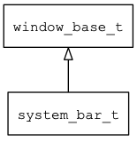

## system\_bar\_t
### 概述


 system\_bar窗口。

 system\_bar窗口是一种特殊的窗口，独占LCD顶部区域，用来显示当前窗口的标题和关闭按钮等内容。

> system\_bar窗口需要在打开第一个应用程序窗口之前打开。

 system_bar对两个子控件会做特殊处理：

 * 1.名为"title"的label控件，自动显示当前主窗口的name或text。
 * 2.名为"close"的button控件，点击之后向当前主窗口发送EVT\_REQUEST\_CLOSE\_WINDOW消息。

system\_bar\_t是[window\_base\_t](window_base_t.md)的子类控件，
 window\_base\_t的函数均适用于system\_bar\_t控件。

 在xml中使用"system\_bar"标签创建system\_bar窗口。如：

 ```xml
 <system_bar h="30">
 <column x="0" y="0" w="-40" h="100%">
   <label style="title" x="10" y="m" w="55%" h="100%" name="title"/>
   <digit_clock style="time" x="r" y="m" w="40%" h="100%" format="hh:mm"/>
 </column>
 <button style="close" x="r:5" y="m" w="26" h="26" name="close" text="x"/>
 </system_bar>
 ```

 > 更多用法请参考：
 [system_bar](https://github.com/zlgopen/awtk/blob/master/demos/assets/raw/ui/system_bar.xml)

 在c代码中使用函数system\_bar\_create创建system\_bar窗口。如：

 ```c
 widget_t* win = system_bar_create(NULL, 0, 0, 320, 30);
 ```

 > 创建之后，和使用普通窗口是一样的。

 可用通过style来设置控件的显示风格，如背景颜色等等。如：

 ```xml
 <system_bar>
  <style name="default">
    <normal bg_color="#a0a0a0"/>
  </style>
 </system_bar>
 ```

> 更多用法请参考：
 [system_bar.xml](https://github.com/zlgopen/awtk/blob/master/demos/assets/raw/styles/system_bar.xml)


----------------------------------
### 函数
<p id="system_bar_t_methods">

| 函数名称 | 说明 | 
| -------- | ------------ | 
| <a href="#system_bar_t_system_bar_cast">system\_bar\_cast</a> | 转换为system_bar对象(供脚本语言使用)。 |
| <a href="#system_bar_t_system_bar_create">system\_bar\_create</a> | 创建system_bar对象。 |
#### system\_bar\_cast 函数
-----------------------

* 函数功能：

> <p id="system_bar_t_system_bar_cast"> 转换为system_bar对象(供脚本语言使用)。


* 函数原型：

```
widget_t* system_bar_cast (widget_t* widget);
```

* 参数说明：

| 参数 | 类型 | 说明 |
| -------- | ----- | --------- |
| 返回值 | widget\_t* | system\_bar对象。 |
| widget | widget\_t* | system\_bar对象。 |
#### system\_bar\_create 函数
-----------------------

* 函数功能：

> <p id="system_bar_t_system_bar_create"> 创建system_bar对象。


* 函数原型：

```
widget_t* system_bar_create (widget_t* parent, xy_t x, xy_t y, wh_t w, wh_t h);
```

* 参数说明：

| 参数 | 类型 | 说明 |
| -------- | ----- | --------- |
| 返回值 | widget\_t* | system\_bar对象。 |
| parent | widget\_t* | 父控件 |
| x | xy\_t | x坐标 |
| y | xy\_t | y坐标 |
| w | wh\_t | 宽度 |
| h | wh\_t | 高度 |
