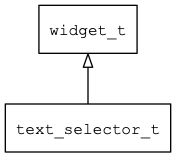

## text\_selector\_t
### 概述
 文本选择器控件，通常用于选择年月日等。
 XXX: 目前需要先设置options和visible_nr，再设置其它参数(在XML中也需要按此顺序)。

### 函数

| 函数名称 | 说明 | 
| -------- | ------------ | 
| <a href="#text_selector_t_text_selector_append_option">text\_selector\_append\_option</a> |  追加一个选项。
 |
| <a href="#text_selector_t_text_selector_cast">text\_selector\_cast</a> |  转换text_selector对象(供脚本语言使用)。
 |
| <a href="#text_selector_t_text_selector_count_options">text\_selector\_count\_options</a> |  获取选项个数。
 |
| <a href="#text_selector_t_text_selector_create">text\_selector\_create</a> |  创建text_selector对象
 |
| <a href="#text_selector_t_text_selector_get_option">text\_selector\_get\_option</a> |  获取第index个选项。
 |
| <a href="#text_selector_t_text_selector_get_text">text\_selector\_get\_text</a> |  获取text_selector的文本。
 |
| <a href="#text_selector_t_text_selector_get_value">text\_selector\_get\_value</a> |  获取text_selector的值。
 |
| <a href="#text_selector_t_text_selector_reset_options">text\_selector\_reset\_options</a> |  重置所有选项。
 |
| <a href="#text_selector_t_text_selector_set_options">text\_selector\_set\_options</a> |  设置选项。
 |
| <a href="#text_selector_t_text_selector_set_range_options">text\_selector\_set\_range\_options</a> |  设置一系列的整数选项。
 |
| <a href="#text_selector_t_text_selector_set_selected_index">text\_selector\_set\_selected\_index</a> |  设置第index个选项为当前选中的选项。
 |
| <a href="#text_selector_t_text_selector_set_text">text\_selector\_set\_text</a> |  设置text_selector的文本。
 |
| <a href="#text_selector_t_text_selector_set_value">text\_selector\_set\_value</a> |  设置text_selector的值。
 |
| <a href="#text_selector_t_text_selector_set_visible_nr">text\_selector\_set\_visible\_nr</a> |  设置可见的选项数。
 |
### 属性

| 名属性称 | 类型 | 说明 | 
| -------- | ----- | ------------ | 
| <a href="#text_selector_t_options">options</a> | char* |  设置可选项(冒号分隔值和文本，分号分隔选项，如:1:red;2:green;3:blue)。
 |
| <a href="#text_selector_t_selected_index">selected\_index</a> | int32_t |  当前选中的选项。
 |
| <a href="#text_selector_t_visible_nr">visible\_nr</a> | uint32_t |  可见的选项数量(只能是3或者5，缺省为5)。
 |
### 事件

| 事件名称 | 类型  | 说明 | 
| -------- | ----- | ------- | 
| EVT\_VALUE\_WILL\_CHANGE | event\_t | 值(当前项)即将改变事件。 |
| EVT\_VALUE\_CHANGED | event\_t | 值(当前项)改变事件。 |
#### text\_selector\_append\_option 函数
-----------------------

| 参数 | 类型 | 说明 |
| -------- | ----- | --------- |
| 返回值 | ret\_t | 返回RET\_OK表示成功，否则表示失败。 |
| widget | widget\_t* | text\_selector对象。 |
| value | int32\_t | 值。 |
| text | char* | 文本。 |

 追加一个选项。

#### text\_selector\_cast 函数
-----------------------

| 参数 | 类型 | 说明 |
| -------- | ----- | --------- |
| 返回值 | widget\_t* | text\_selector对象。 |
| widget | widget\_t* | text\_selector对象。 |

 转换text_selector对象(供脚本语言使用)。

#### text\_selector\_count\_options 函数
-----------------------

| 参数 | 类型 | 说明 |
| -------- | ----- | --------- |
| 返回值 | int32\_t | 返回选项个数。 |
| widget | widget\_t* | text\_selector对象。 |

 获取选项个数。

#### text\_selector\_create 函数
-----------------------

| 参数 | 类型 | 说明 |
| -------- | ----- | --------- |
| 返回值 | widget\_t* | 对象。 |
| parent | widget\_t* | 父控件 |
| x | xy\_t | x坐标 |
| y | xy\_t | y坐标 |
| w | wh\_t | 宽度 |
| h | wh\_t | 高度 |

 创建text_selector对象

#### text\_selector\_get\_option 函数
-----------------------

| 参数 | 类型 | 说明 |
| -------- | ----- | --------- |
| 返回值 | text\_selector\_option\_t* | 成功返回选项，失败返回NULL。 |
| widget | widget\_t* | text\_selector对象。 |
| index | uint32\_t | 选项的索引。 |

 获取第index个选项。

#### text\_selector\_get\_text 函数
-----------------------

| 参数 | 类型 | 说明 |
| -------- | ----- | --------- |
| 返回值 | char* | 返回文本。 |
| widget | widget\_t* | text\_selector对象。 |

 获取text_selector的文本。

#### text\_selector\_get\_value 函数
-----------------------

| 参数 | 类型 | 说明 |
| -------- | ----- | --------- |
| 返回值 | int32\_t | 返回值。 |
| widget | widget\_t* | text\_selector对象。 |

 获取text_selector的值。

#### text\_selector\_reset\_options 函数
-----------------------

| 参数 | 类型 | 说明 |
| -------- | ----- | --------- |
| 返回值 | ret\_t | 返回RET\_OK表示成功，否则表示失败。 |
| widget | widget\_t* | text\_selector对象。 |

 重置所有选项。

#### text\_selector\_set\_options 函数
-----------------------

| 参数 | 类型 | 说明 |
| -------- | ----- | --------- |
| 返回值 | ret\_t | 返回RET\_OK表示成功，否则表示失败。 |
| widget | widget\_t* | text\_selector对象。 |
| options | char* | 选项。 |

 设置选项。

#### text\_selector\_set\_range\_options 函数
-----------------------

| 参数 | 类型 | 说明 |
| -------- | ----- | --------- |
| 返回值 | ret\_t | 返回RET\_OK表示成功，否则表示失败。 |
| widget | widget\_t* | text\_selector对象。 |
| start | int32\_t | 起始值。 |
| nr | uint32\_t | 个数。 |
| step | int32\_t | 步长。 |

 设置一系列的整数选项。

#### text\_selector\_set\_selected\_index 函数
-----------------------

| 参数 | 类型 | 说明 |
| -------- | ----- | --------- |
| 返回值 | ret\_t | 返回RET\_OK表示成功，否则表示失败。 |
| widget | widget\_t* | text\_selector对象。 |
| index | uint32\_t | 选项的索引。 |

 设置第index个选项为当前选中的选项。

#### text\_selector\_set\_text 函数
-----------------------

| 参数 | 类型 | 说明 |
| -------- | ----- | --------- |
| 返回值 | ret\_t | 返回RET\_OK表示成功，否则表示失败。 |
| widget | widget\_t* | text\_selector对象。 |
| text | const char* | 文本。 |

 设置text_selector的文本。

#### text\_selector\_set\_value 函数
-----------------------

| 参数 | 类型 | 说明 |
| -------- | ----- | --------- |
| 返回值 | ret\_t | 返回RET\_OK表示成功，否则表示失败。 |
| widget | widget\_t* | text\_selector对象。 |
| value | int32\_t | 值。 |

 设置text_selector的值。

#### text\_selector\_set\_visible\_nr 函数
-----------------------

| 参数 | 类型 | 说明 |
| -------- | ----- | --------- |
| 返回值 | ret\_t | 返回RET\_OK表示成功，否则表示失败。 |
| widget | widget\_t* | text\_selector对象。 |
| visible\_nr | uint32\_t | 选项数。 |

 设置可见的选项数。

#### options 属性
-----------------------

 设置可选项(冒号分隔值和文本，分号分隔选项，如:1:red;2:green;3:blue)。
 对于数值选项，也可以指定一个范围，用『-』分隔起始值和结束值，如："1-7"表示1到7。

* 类型：char*

| 特性 | 是否支持 |
| -------- | ----- |
| 可直接读取 | 是 |
| 可直接修改 | 否 |
| 可持久化   | 是 |
| 可脚本化   | 是 |
| 可在IDE中设置 | 是 |
| 可在XML中设置 | 是 |
| 支通过widget_get_prop读取 | 是 |
| 支通过widget_set_prop修改 | 是 |
#### selected\_index 属性
-----------------------

 当前选中的选项。

* 类型：int32\_t

| 特性 | 是否支持 |
| -------- | ----- |
| 可直接读取 | 是 |
| 可直接修改 | 否 |
| 可持久化   | 是 |
| 可脚本化   | 是 |
| 可在IDE中设置 | 是 |
| 可在XML中设置 | 是 |
| 支通过widget_get_prop读取 | 是 |
| 支通过widget_set_prop修改 | 是 |
#### visible\_nr 属性
-----------------------

 可见的选项数量(只能是3或者5，缺省为5)。

* 类型：uint32\_t

| 特性 | 是否支持 |
| -------- | ----- |
| 可直接读取 | 是 |
| 可直接修改 | 否 |
| 可持久化   | 是 |
| 可脚本化   | 是 |
| 可在IDE中设置 | 是 |
| 可在XML中设置 | 是 |
| 支通过widget_get_prop读取 | 是 |
| 支通过widget_set_prop修改 | 是 |
