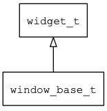

## window\_base\_t
### 概述

 窗口。

 本类把窗口相关的公共行为进行抽象，放到一起方便重用。目前已知的具体实现如下图：

 

 > 本类是一个抽象类，不能进行实例化。请在应用程序中使用具体的类，如window\_t。

### 函数

| 函数名称 | 说明 | 
| -------- | ------------ | 
### 属性

| 名属性称 | 类型 | 说明 | 
| -------- | ----- | ------------ | 
| <a href="#window_base_t_assets_manager">assets\_manager</a> | assets\_manager\_t* | 获取资源管理器对象。 |
| <a href="#window_base_t_closable">closable</a> | window\_closable\_t | 收到EVT\_REQUEST\_CLOSE\_WINDOW是否自动关闭窗口。 |
| <a href="#window_base_t_close_anim_hint">close\_anim\_hint</a> | char* | 关闭窗口动画的名称。 |
| <a href="#window_base_t_font_manager">font\_manager</a> | font\_manager\_t* | 获取字体管理器对象。 |
| <a href="#window_base_t_image_manager">image\_manager</a> | image\_manager\_t* | 获取图片管理器对象。 |
| <a href="#window_base_t_open_anim_hint">open\_anim\_hint</a> | char* | 打开窗口动画的名称。 |
| <a href="#window_base_t_script">script</a> | char* | 脚本文件名称(暂时没用)。 |
| <a href="#window_base_t_stage">stage</a> | char* | 窗口当前处于的状态。 |
| <a href="#window_base_t_theme">theme</a> | char* | 主题资源的名称。 |
| <a href="#window_base_t_theme_obj">theme\_obj</a> | theme\_t* | 窗口的常量主题数据。 |
### 事件

| 事件名称 | 类型  | 说明 | 
| -------- | ----- | ------- | 
#### assets\_manager 属性
-----------------------
> 
 获取资源管理器对象。

 > 把资源管理器对象与窗口关联起来，是为了解决UI设计器与被设计的窗口需要从不同的位置加载资源资源的问题。

* 类型：assets\_manager\_t*

| 特性 | 是否支持 |
| -------- | ----- |
| 可直接读取 | 否 |
| 可直接修改 | 否 |
| 可持久化   | 否 |
| 可脚本化   | 否 |
| 可在IDE中设置 | 否 |
| 可在XML中设置 | 是 |
| 支通过widget_get_prop读取 | 是 |
| 支通过widget_set_prop修改 | 否 |
#### closable 属性
-----------------------
> 
 收到EVT\_REQUEST\_CLOSE\_WINDOW是否自动关闭窗口。

 如果关闭窗口时，需要用户确认:

 * 1.将closable设置为WINDOW\_CLOSABLE\_CONFIRM

 * 2.处理窗口的EVT\_REQUEST\_CLOSE\_WINDOW事件

> closable在XML中取值为：yes/no/confirm，缺省为yes。

* 类型：window\_closable\_t

| 特性 | 是否支持 |
| -------- | ----- |
| 可直接读取 | 是 |
| 可直接修改 | 否 |
| 可持久化   | 是 |
| 可脚本化   | 是 |
| 可在IDE中设置 | 是 |
| 可在XML中设置 | 是 |
| 支通过widget_get_prop读取 | 是 |
| 支通过widget_set_prop修改 | 是 |
#### close\_anim\_hint 属性
-----------------------
> 
 关闭窗口动画的名称。
 请参考[窗口动画](https://github.com/zlgopen/awtk/blob/master/docs/window_animator.md)

* 类型：char*

| 特性 | 是否支持 |
| -------- | ----- |
| 可直接读取 | 是 |
| 可直接修改 | 否 |
| 可持久化   | 是 |
| 可脚本化   | 否 |
| 可在IDE中设置 | 是 |
| 可在XML中设置 | 是 |
| 支通过widget_get_prop读取 | 是 |
| 支通过widget_set_prop修改 | 是 |
#### font\_manager 属性
-----------------------
> 
 获取字体管理器对象。

> 把字体管理器对象与窗口关联起来，是为了解决UI设计器与被设计的窗口需要从不同的位置加载字体资源的问题。

* 类型：font\_manager\_t*

| 特性 | 是否支持 |
| -------- | ----- |
| 可直接读取 | 否 |
| 可直接修改 | 否 |
| 可持久化   | 否 |
| 可脚本化   | 否 |
| 可在IDE中设置 | 否 |
| 可在XML中设置 | 是 |
| 支通过widget_get_prop读取 | 是 |
| 支通过widget_set_prop修改 | 否 |
#### image\_manager 属性
-----------------------
> 
 获取图片管理器对象。

> 把图片管理器对象与窗口关联起来，是为了解决UI设计器与被设计的窗口需要从不同的位置加载图片资源的问题。

* 类型：image\_manager\_t*

| 特性 | 是否支持 |
| -------- | ----- |
| 可直接读取 | 否 |
| 可直接修改 | 否 |
| 可持久化   | 否 |
| 可脚本化   | 否 |
| 可在IDE中设置 | 否 |
| 可在XML中设置 | 是 |
| 支通过widget_get_prop读取 | 是 |
| 支通过widget_set_prop修改 | 否 |
#### open\_anim\_hint 属性
-----------------------
> 
 打开窗口动画的名称。
 请参考[窗口动画](https://github.com/zlgopen/awtk/blob/master/docs/window_animator.md)

* 类型：char*

| 特性 | 是否支持 |
| -------- | ----- |
| 可直接读取 | 是 |
| 可直接修改 | 否 |
| 可持久化   | 是 |
| 可脚本化   | 否 |
| 可在IDE中设置 | 是 |
| 可在XML中设置 | 是 |
| 支通过widget_get_prop读取 | 是 |
| 支通过widget_set_prop修改 | 是 |
#### script 属性
-----------------------
> 
 脚本文件名称(暂时没用)。

* 类型：char*

| 特性 | 是否支持 |
| -------- | ----- |
| 可直接读取 | 是 |
| 可直接修改 | 否 |
| 可持久化   | 是 |
| 可脚本化   | 否 |
| 可在IDE中设置 | 是 |
| 可在XML中设置 | 是 |
| 支通过widget_get_prop读取 | 是 |
| 支通过widget_set_prop修改 | 是 |
#### stage 属性
-----------------------
> 
 窗口当前处于的状态。

* 类型：char*

| 特性 | 是否支持 |
| -------- | ----- |
| 可直接读取 | 是 |
| 可直接修改 | 否 |
| 可持久化   | 否 |
| 可脚本化   | 否 |
| 可在IDE中设置 | 否 |
| 可在XML中设置 | 是 |
| 支通过widget_get_prop读取 | 是 |
| 支通过widget_set_prop修改 | 否 |
#### theme 属性
-----------------------
> 
 主题资源的名称。
 每个窗口都可以有独立的主题文件，如果没指定，则使用系统缺省的主题文件。
 主题是一个XML文件，放在assets/raw/styles目录下。
 请参考[主题](https://github.com/zlgopen/awtk/blob/master/docs/theme.md)

* 类型：char*

| 特性 | 是否支持 |
| -------- | ----- |
| 可直接读取 | 是 |
| 可直接修改 | 否 |
| 可持久化   | 是 |
| 可脚本化   | 是 |
| 可在IDE中设置 | 是 |
| 可在XML中设置 | 是 |
| 支通过widget_get_prop读取 | 是 |
| 支通过widget_set_prop修改 | 是 |
#### theme\_obj 属性
-----------------------
> 
 窗口的常量主题数据。

> 把主题管理器对象与窗口关联起来，是为了解决UI设计器与被设计的窗口需要从不同的位置加载主题资源的问题。

* 类型：theme\_t*

| 特性 | 是否支持 |
| -------- | ----- |
| 可直接读取 | 否 |
| 可直接修改 | 否 |
| 可持久化   | 否 |
| 可脚本化   | 否 |
| 可在IDE中设置 | 否 |
| 可在XML中设置 | 是 |
| 支通过widget_get_prop读取 | 是 |
| 支通过widget_set_prop修改 | 否 |
