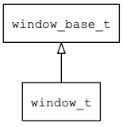

## window\_t
### 概述


 窗口。

 缺省的应用程序窗口，占用除system\_bar\_t之外的整个区域，请不要修改它的位置和大小(除非你清楚后果)。

 window\_t是[window\_base\_t](window_base_t.md)的子类控件，window\_base\_t的函数均适用于window\_t控件。

 在xml中使用"window"标签创建窗口。无需指定坐标和大小，可以指定主题和动画名称。如：

 ```xml
 <window theme="basic" anim_hint="htranslate">
 ...
 </window>
 ```

 >
 更多用法请参考：[window.xml](https://github.com/zlgopen/awtk/blob/master/demos/assets/raw/ui/)

 在c代码中使用函数window\_create创建窗口。如：

 ```c
  widget_t* window = window_create(NULL, 0, 0, 0, 0);
 ```

 > 无需指定父控件、坐标和大小，使用0即可。

 > 完整示例请参考：[window
 demo](https://github.com/zlgopen/awtk-c-demos/blob/master/demos/)

 可用通过style来设置窗口的风格，如背景颜色或图片等。如：

 ```xml
 <style name="bricks">
  <normal bg_image="bricks"  bg_image_draw_type="repeat"/>
 </style>
 ```

 > 更多用法请参考：[theme
 default](https://github.com/zlgopen/awtk/blob/master/demos/assets/raw/styles/default.xml#L0)
### 函数
<p id="window_t_methods">

| 函数名称 | 说明 | 
| -------- | ------------ | 
| <a href="#window_t_window_cast">window\_cast</a> | 转换为window对象(供脚本语言使用)。 |
| <a href="#window_t_window_close">window\_close</a> | 关闭窗口。 |
| <a href="#window_t_window_create">window\_create</a> | 创建window对象 |
| <a href="#window_t_window_open">window\_open</a> | 从资源文件中加载并创建window_base对象。本函数在ui_loader/ui_builder_default里实现。 |
| <a href="#window_t_window_open_and_close">window\_open\_and\_close</a> | 从资源文件中加载并创建window_base对象。本函数在ui_loader/ui_builder_default里实现。 |
### 属性
<p id="window_t_properties">

| 名属性称 | 类型 | 说明 | 
| -------- | ----- | ------------ | 
### 事件
<p id="window_t_events">

| 事件名称 | 类型  | 说明 | 
| -------- | ----- | ------- | 
#### window\_cast 函数
-----------------------

* 函数功能：

> <p id="window_t_window_cast"> 转换为window对象(供脚本语言使用)。


* 函数原型：

```
widget_t* window_cast (widget_t* widget);
```

* 参数说明：

| 参数 | 类型 | 说明 |
| -------- | ----- | --------- |
| 返回值 | widget\_t* | window对象。 |
| widget | widget\_t* | window对象。 |
#### window\_close 函数
-----------------------

* 函数功能：

> <p id="window_t_window_close"> 关闭窗口。


* 函数原型：

```
ret_t window_close (widget_t* widget);
```

* 参数说明：

| 参数 | 类型 | 说明 |
| -------- | ----- | --------- |
| 返回值 | ret\_t | 返回RET\_OK表示成功，否则表示失败。 |
| widget | widget\_t* | window\_base对象。 |
#### window\_create 函数
-----------------------

* 函数功能：

> <p id="window_t_window_create"> 创建window对象


* 函数原型：

```
widget_t* window_create (widget_t* parent, xy_t x, xy_t y, wh_t w, wh_t h);
```

* 参数说明：

| 参数 | 类型 | 说明 |
| -------- | ----- | --------- |
| 返回值 | widget\_t* | 对象。 |
| parent | widget\_t* | 父控件 |
| x | xy\_t | x坐标 |
| y | xy\_t | y坐标 |
| w | wh\_t | 宽度 |
| h | wh\_t | 高度 |
#### window\_open 函数
-----------------------

* 函数功能：

> <p id="window_t_window_open"> 从资源文件中加载并创建window_base对象。本函数在ui_loader/ui_builder_default里实现。


* 函数原型：

```
widget_t* window_open (char* name);
```

* 参数说明：

| 参数 | 类型 | 说明 |
| -------- | ----- | --------- |
| 返回值 | widget\_t* | 对象。 |
| name | char* | window\_base的名称。 |
#### window\_open\_and\_close 函数
-----------------------

* 函数功能：

> <p id="window_t_window_open_and_close"> 从资源文件中加载并创建window_base对象。本函数在ui_loader/ui_builder_default里实现。


* 函数原型：

```
widget_t* window_open_and_close (char* name, widget_t* to_close);
```

* 参数说明：

| 参数 | 类型 | 说明 |
| -------- | ----- | --------- |
| 返回值 | widget\_t* | 对象。 |
| name | char* | window\_base的名称。 |
| to\_close | widget\_t* | 关闭该窗口。 |
